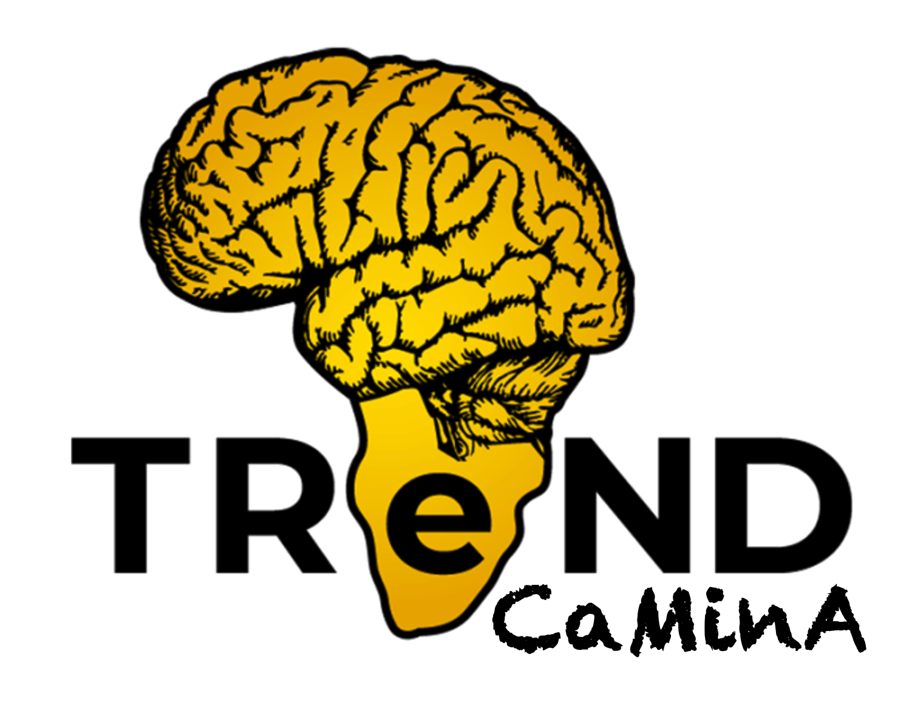
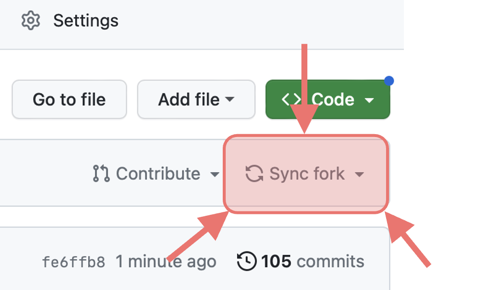

#  TReND-CaMinA school in Computational Neuroscience and Machine Learning Basics 

### TReND-CaMinA is an intensive entry level course to teach young African students and researchers the basics of computational neuroscience and machine learning

During this course, we give a basic introduction topics including neurobiology, systems neuroscience, biophysical neural models, recurrent neural networks, dynamical systems, linear algebra, machine learning methods for neural data analysis, Bayesian statistics, deep learning and reinforcement learning. We aim to provide African students and researchers with a solid foundation from which they can further expand their horizons. 

For more information on the school please visit https://trendinafrica.org/trend-camina/

This repository contains the coding exercises for the school.

Materials such as slides, datasets and other resources can be found in our [google drive](https://drive.google.com/drive/folders/1hEuJtBv4-z3vqaoePIumXkJx0cWdzMx5?usp=drive_link).

### **Notice! Remember to sync your fork**

Do this daily to recieve the latest updates to the tutorials.

